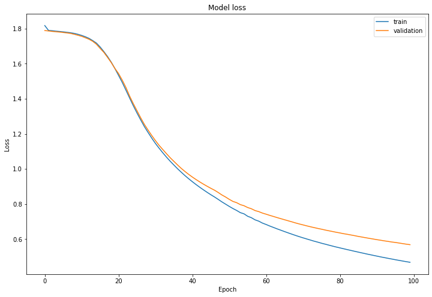
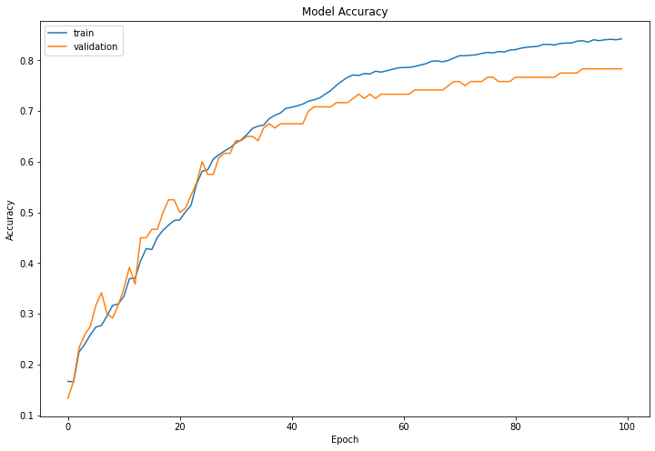

#  Sign Language Digit Classifier (CNN using TensorFlow/Keras)

> A fun and visual journey into teaching machines how to understand hand signs!

---

### 👋 About

This is the **second mini-project** in my Convolutional Neural Networks journey. Here, I’ve built a model that can recognize **hand signs representing digits from 0 to 5**. The CNN was implemented using the **TensorFlow Keras Functional API**, trained on images of hands showing various finger positions.

Unlike traditional machine learning, we use deep convolutional layers to **extract spatial patterns** from the images, like edges, textures, and shapes of the fingers and then classify the gesture into the correct digit.

---

###  Dataset & Labels

The dataset contains labeled images of hand gestures (0 to 5). The labels are one-hot encoded:


Each input image looks like this (64x64x3):


---

### 🧱 Model Architecture

```text
Input → Conv2D (8 filters) → ReLU → MaxPool
      → Conv2D (16 filters) → ReLU → MaxPool
      → Flatten → Dense (softmax with 6 units)
```

---

###  Hyperparameters
All Conv2D layers use "SAME" padding
- Conv1: 8 filters of size 4x4, stride = 1
- MaxPool1: 8x8 pool size, stride = 8
- Conv2: 16 filters of size 2x2, stride = 1
- MaxPool2: 4x4 pool size, stride = 4
- Final Dense Layer: 6 neurons (one for each class: 0-5)

---

### Training
I plotted both loss and accuracy for training and validation sets to evaluate learning progress.
```text
df_loss.plot(title='Model Loss')
df_acc.plot(title='Model Accuracy')
```

---
## 📊 Training Results

To evaluate the model's performance, we trained it for **100 epochs** and monitored both **loss** and **accuracy** on the training and validation datasets.

### 🔻 Loss Curve


The **loss curve** shows a consistent decrease in both training and validation loss over time. This steady downward trend is a good sign, it means that the model is effectively minimizing the error during training without diverging. The slight gap between the two curves is expected here and does **not indicate overfitting**.

### 🔺 Accuracy Curve


The **accuracy curve** shows how the model improved its prediction capability over time. Both training and validation accuracy steadily increased, with validation accuracy closely following the training accuracy. This suggests the model is **generalizing well** and is not simply memorizing the training data.

This performance indicates that the model has been trained well and is suitable for making reliable predictions on unseen data.(Uff!)


---


## 🔁 Related Projects
This is the **second project** in my CNN series.

Check out my first project where I built a complete Convolutional Neural Network from scratch using NumPy only (no frameworks!):

🔗 [CNN Engine in Pure NumPy](https://github.com/maverick4code/CNN-Engine-in-Pure-NumPy)
